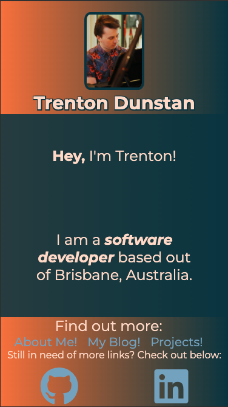
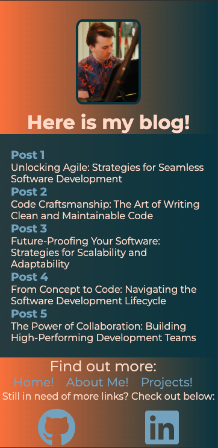
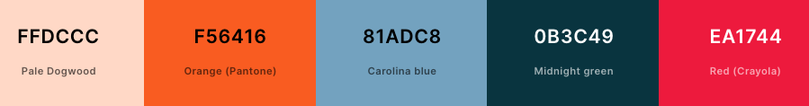
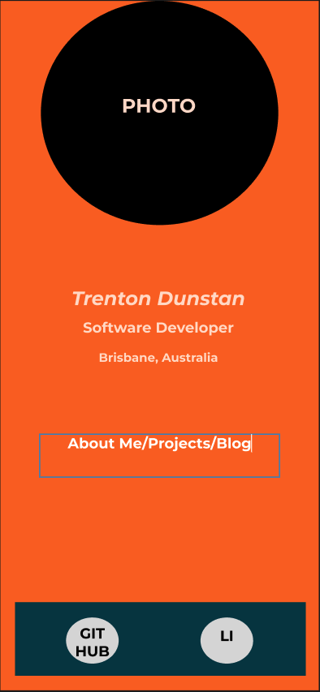

# Trenton Dunstan Portfolio

Link: [Portfolio Website](https://trentondunstanportolio.netlify.app/)

GitHub repo: [Portfolio Website Repo](https://github.com/TrentOnTrent/Portfolio)

## Functionality/features
Features of the website include the ability to read multiple blog posts on IT and software-related industry points, links to GitHub and LinkedIn profiles as well as a resume, and seemless navigation and responsiveness to utilise the website.

## Screenshots

## Sitemap (italics to denote external links): 

## Navigation
The home page will act as a landing page for users, outlining and introducing the links that are available and can be navigated therein.  The "About Me" page offers more information about myself, including a link to a PDF resume that can be viewed. The "Projects" page offers links to public GitHub repositories that can be navigated and explored. The "Blog" page offers links to various blog articles on various software development concepts/ideas.  

The website will mainly be navigated by the links towards the bottom of the page in order to keep a clean aesthetic towards the top with the image component and content on each page, with links to a LinkedIn and GitHub profiles available on each page.  

## Target audience
The target audience of the website is any software industry professionals, including employers, other colleagues and software developers. It utilises a tech stack of HTML5, CSS3, as well as being deployed utilising Netlify and will also feature Javascript in the near future.

## Aesthetic of Website
The overall aesthetic was based off a colour palette generated through Coolors.co: 

This then influenced the originating mockups: 

During development, the main background of the website was changed from a block Orange (Pantone) colour to, instead, a Orange (Pantone) to Midnight Green gradient, with a block Midnight Green background designating the main content-related section of the website in order to make various sections clearer.  Pale Dogwood was used instead of a more standard white colour, giving a softer look.

## Components
A list of components used:
- Header, with cover image used on each page, sizing appropriately based on size of the viewport, keeping aspect ratio whilst resizing by utilising flexbox
- Call to action footer links, with appropriate behaviour based off hovering and underlining when needed by utilising flexbox
- Ordered and unordered lists, utilised in blog posts and "About Me" page
- Blog with blog post links, viewport sizing dynamically based off amount of content on each page

