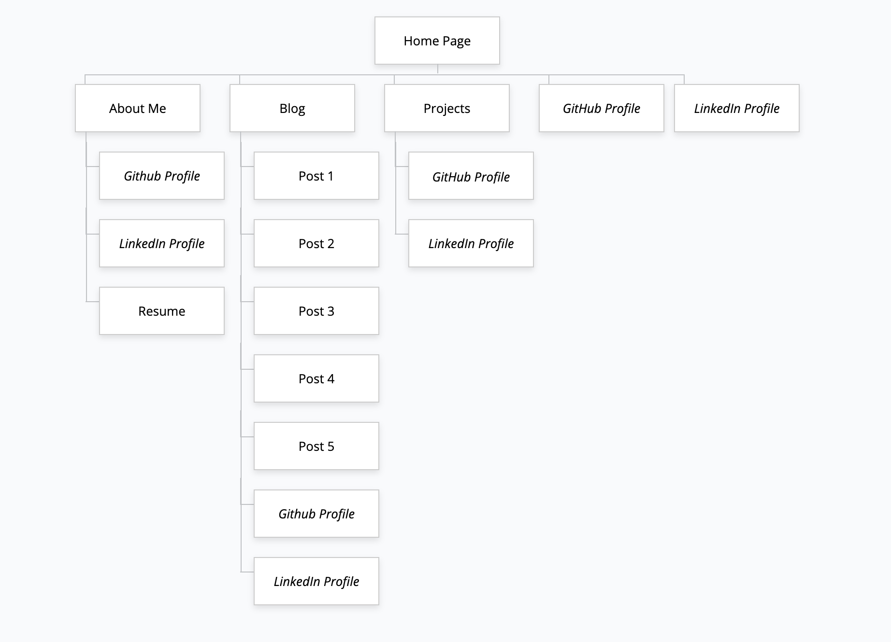

# Trenton Dunstan Portfolio

A link (URL) to your published portfolio website: [Portfolio Website](https://trentontrent.github.io/Portfolio/)

A link to your GitHub repo: [Portfolio Website Repo](https://github.com/TrentOnTrent/Portfolio)

Description of your portfolio website, including,
Purpose: To display to potential employers and industry professionals projects that have been worked on and added to.

Functionality / features

Screenshots

Sitemap (italics to denote external links): 

Target audience

Tech stack: HTML5, CSS3, deployed utilising GitHub Pages
